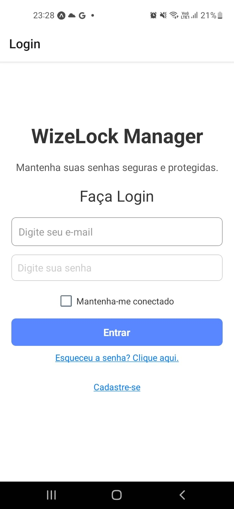
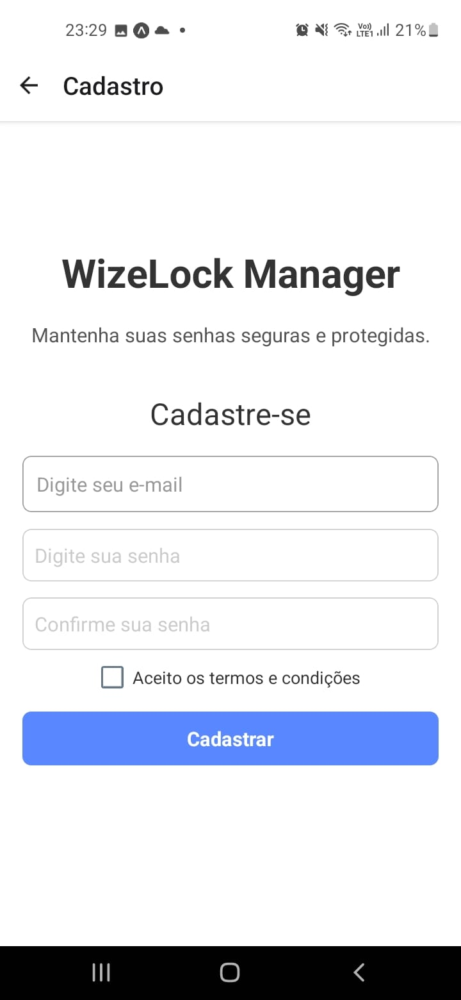
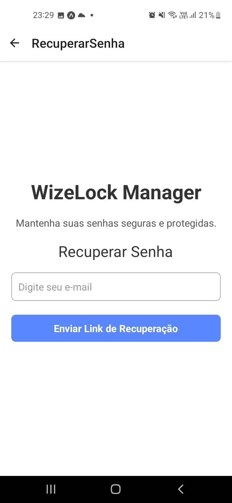

# WizeLock - Gerenciamento de Senhas

**WizeLock** é um aplicativo móvel para gerenciamento de senhas desenvolvido com **React Native** e **Expo**. O objetivo do aplicativo é permitir que os usuários mantenham suas senhas seguras, protegidas e acessíveis de forma prática e intuitiva. A aplicação oferece funcionalidades de login, registro, recuperação de senha e muito mais.

## Índice

- [Visão Geral](#visão-geral)
- [Tecnologias](#tecnologias)
- [Instalação](#instalação)
- [Como Usar](#como-usar)
- [Funcionalidades](#funcionalidades)
- [Licença](#licença)

## Visão Geral

WizeLock oferece um sistema simples e seguro para gerenciamento de senhas. O aplicativo permite que os usuários se registrem, façam login e, caso necessário, recuperem suas senhas de forma rápida. Ele utiliza a criptografia e validação de dados para garantir a segurança das informações.

## Tecnologias

Este aplicativo foi desenvolvido utilizando as seguintes tecnologias:

- **React Native** - Framework para criação de aplicativos móveis nativos utilizando JavaScript e React.
- **Expo** - Ferramenta que facilita o desenvolvimento e a execução de aplicativos React Native.
- **React Navigation** - Biblioteca para navegação entre telas no React Native.
- **Expo Checkbox** - Componente para criação de caixas de seleção.
- **React State** - Gerenciamento de estado da aplicação.
- **Styled Components** - Biblioteca para estilização de componentes.

## Instalação

Para rodar o aplicativo localmente em seu computador, siga os passos abaixo:

### Pré-requisitos

- [Node.js](https://nodejs.org/) (recomendado versão 14 ou superior)
- [Expo CLI](https://docs.expo.dev/get-started/installation/) (instale com o comando `npm install -g expo-cli`)

### Passos para Instalação

1. **Clone o repositório:**

```bash
git clone https://github.com/adimael/WizeLock-manager.git
````

2. **Instale as dependências do projeto:**

```bash
cd wizelock
npm install
````

3. **Inicie o servidor Expo:**

```bash
npm start
````

4. **Abra o aplicativo em seu dispositivo ou emulador:**

- Utilize o aplicativo Expo Go em seu celular para escanear o QR code gerado.
- Ou, se estiver em um emulador, ele será aberto automaticamente.

### Como Usar
**Tela de Login:**



- O usuário pode entrar no aplicativo inserindo seu e-mail e senha.
- Caso o usuário não tenha uma conta, pode se registrar clicando no link "Cadastre-se".
- Caso o usuário tenha esquecido a senha, pode clicar em "Esqueceu a senha?".

**Tela de Cadastro:**



- O usuário pode criar uma nova conta fornecendo o e-mail, nome de usuário e senha.

**Tela de Recuperação de Senha:**



- O usuário pode inserir seu e-mail para recuperar a senha, que será enviada para o e-mail informado.

### Funcionalidades
- `Login de Usuário:` O usuário pode fazer login fornecendo seu e-mail e senha.
- `Cadastro de Usuário:` O usuário pode se cadastrar para criar uma nova conta.
- `Recuperação de Senha:` Permite que o usuário recupere a senha caso tenha esquecido.
- `Manter-se Conectado:` O aplicativo oferece uma opção para manter o usuário logado.
- `Validação de E-mail e Senha:` O aplicativo realiza validações de e-mail e senha antes de permitir o login.

## Licença

### Este projeto está licenciado sob a MIT License.

````
### Detalhes sobre a estrutura do `README.md`:
1. **Visão Geral**: Explica o que é o aplicativo e o seu propósito.
2. **Tecnologias**: Lista as ferramentas e bibliotecas utilizadas.
3. **Instalação**: Passo a passo de como rodar o aplicativo localmente.
4. **Como Usar**: Explica as funcionalidades principais do aplicativo.
5. **Funcionalidades**: Descrição das funcionalidades mais importantes.
6. **Imagens das Telas**: Inclui imagens representativas das telas do aplicativo. Você pode substituir os links das imagens de exemplo pelo caminho correto para as imagens do seu projeto.
7. **Contribuindo**: Orientações de como contribuir com o projeto.
8. **Licença**: A licença do projeto, neste caso, MIT.

### Imagens das Telas:
Para adicionar imagens ao seu `README.md`, crie uma pasta `assets/screens/` no seu projeto e adicione as imagens correspondentes às telas. Por exemplo, `login.png`, `cadastro.png`, `recuperar-senha.png`, etc.

Com essas informações, o seu `README.md` estará bem estruturado e pronto para ser compartilhado com outros desenvolvedores ou usuários interessados no projeto.
````
